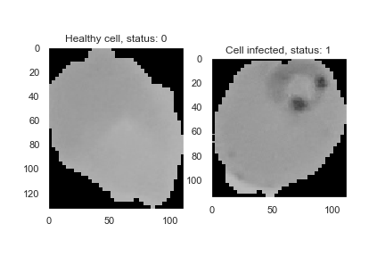
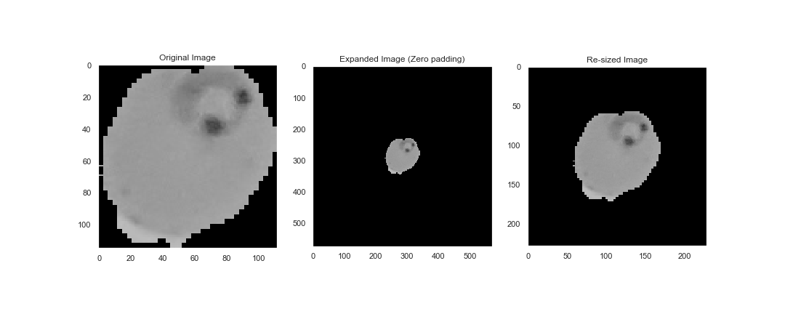

# malariaImagesDetectionClassifier

This project is obviously inspired in the kaggle statement: 
"Save humans by detecting and deploying Image Cells that contain Malaria or not!"

The information was of course obtained directly from kaggle, you can download the whole dataset in the 
following link:
https://www.kaggle.com/iarunava/cell-images-for-detecting-malaria

I gathered all files into a single csv and sampled it into a smaller dataset for both memory and github maximun file size issues. In consequence it is really important to mention that the dataset I used it is much smaller than the original, but still provides a significant amount data to work with (it has 744 images). Also, I only took in consideration the grayscale of the images instead of the rgb values and images, since I considered this does not contributes greatly to the efficacy of the algorithm.

The dataset has two column, the data column and the status column. The first one stored the
data as a list of lists (matrix), where each number is a pixel of the image. The latter is statement whether a cell is infected or not. Status is 1 when cell is infected and zero when is not. 

As a matter of example, the following images two cells, one is healthy and the other is parasited (infected):

It can be seen that Cells infected show gray areas or stains thay can lead the diagnosis of the cell. In general, it seems when a cell has thoses stains is infected, otherwise is healthy. 

#### Preprocessing

Since the images in the datasize have not the same size, all images where resized by adding zero padding in their edges and croping the center or the region of interest. The final size was determined by the biggest width or hight of all images, the idea was to avoid the lost of information. 

The following image describes with an acceptable detail the resized process:

After the resizing, all images were converted to a simple vector instead of matrices. 