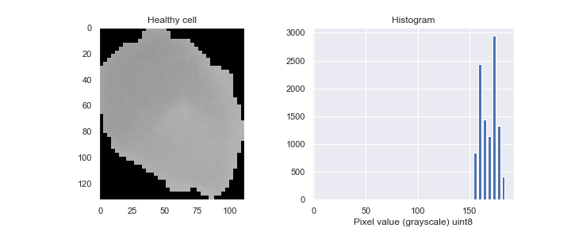
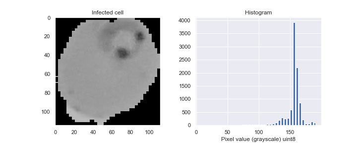
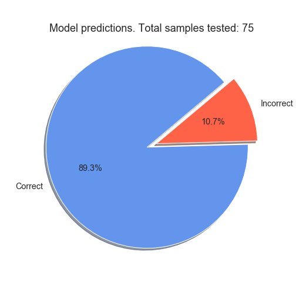

# malariaImagesDetectionClassifier

# Malaria image cells detection model

This project is obviously inspired in the kaggle statement: 
"Save humans by detecting and deploying Image Cells that contain Malaria or not!"

## Idea: 

## Create a classifier to detect image cells that contain Malaria

## Requirements:

* python 3+
* pip3 (if you use venv, soon you will realize why)

If you wan to run the code of this repository, you can clone it and run the jupyter notebook, however, you should install all packages required before to actually run the code. 

The completed list of package used in this project can be found in requeriments.txt. 

##### Python Virtual enviroment
I personally like to use python virtual enviroments in my personal projects, if you want to use it, simply use the executable file Starter of this repo. As a reminder, you need to change the permissions of the file to make it executable, just run in the terminal:

    $ chmod 700 Starter

And then (you can even use this line every time you want to start working with the code):
    
    $ ./Starter

This will change it into an executable file.

This is what it has inside:

    #!/bin/bash
    echo It tries to install packages and set the python virtual env for you
    echo Then run jupyter-notebook
    pip3 install virtualenv
    virtualenv -p python3 venv
    source venv/bin/activate
    pip3 install -r requirements.txt
    jupyter-notebook
    deactivate

It just tries to install virtual env in case you don't have it. 

    $ pip3 install virtualenv

Creates the venv in case you don't have it yet:
    
    $ virtualenv -p python3 venv

Activate the virtual env

    source venv/bin/activate

Install all python packages required:

    pip3 install -r requirements.txt

Run the jupyter-notebook
    
    $ jupyter-notebook

Finally, the last line deactivate it runs when you kill the jupyter notebook. 

## Dataset information

The information was of course obtained directly from kaggle, you can download the whole dataset in the 
following link:

[Kaggle - malaria dataset](https://www.kaggle.com/iarunava/cell-images-for-detecting-malaria)

I gathered all files into a single csv and sampled it into a smaller dataset for both memory and github maximun file size issues. In consequence it is really important to mention that the dataset I used it is much smaller than the original, but still provides a significant amount data to work with (it has 744 images). Also, I only took in consideration the grayscale of the images instead of the rgb values and images, since I considered this does not contributes greatly to the efficacy of the algorithm.

The dataset has two column, the data column and the status column. The first one stored the
data as a list of lists (matrix), where each number is a pixel of the image. The latter is statement whether a cell is infected or not. Status is 1 when cell is infected and zero when is not. 

As a matter of example, the following images two cells, one is healthy and the other is parasited (infected):

It can be seen that Cells infected show gray areas or stains thay can lead the diagnosis of the cell. In general, it seems when a cell has thoses stains is infected, otherwise is healthy. 

## Preprocessing

Since the images in the datasize have not the same size, all images where resized by adding zero padding in their edges and croping the center or the region of interest. The final size was determined by the biggest width or hight of all images, the idea was to avoid the lost of information. 

The following image describes with an acceptable detail the resized process:

After the resizing, all images were converted to a simple vector instead of matrices. With this vector, each value represents a pixel and also a feature. 

Vectors were used to train a logistic regression model but the results were extremely unsuccessful. Then, I decided to make a new transformation of the image into its histogram, because for the original model the observable pattern (the one that has to be enclosed or segmented by the classifier) is in different dimmensions in each sample so the optimization algorithm does not know where to go to truly fit the model and reduce its error. 

The pattern to be identified is clearly observable in the following images, infected cells show values in middle range (0-256) that healthy cells don't. Also, since the information has be translated into a histogram from, the pattern does not change of dimensions (because the histogram does not take in account the location of the pixel, but only their values) so it makes it feasible to the optimization algorithm. 

## Data Splitting  
The datafram contains a total of 744 images. 

Data was splitted as the following:

    original data 
        
        |  ------> test (10%)

        |  ------> subset (90%)

            |   ------> train (75%)
            |   ------> validation (25%)

The training of the model was done with the "train" sub-dataset, validation sub-dataset was used to compare the original model (the model obtained with raw vector of the image) and the histogram-base model. 

The best algorithm was tested with the untouched data "test" sub-dataset.

## Results

After training the logistic regression model with this new data, the results were dramatically improved.

The following image shows the results obtained with the best model. It clearly states that this accuracy was calculated after running the model with the "test" (10% of the original data), that's why it says "Total samples test: 75".

